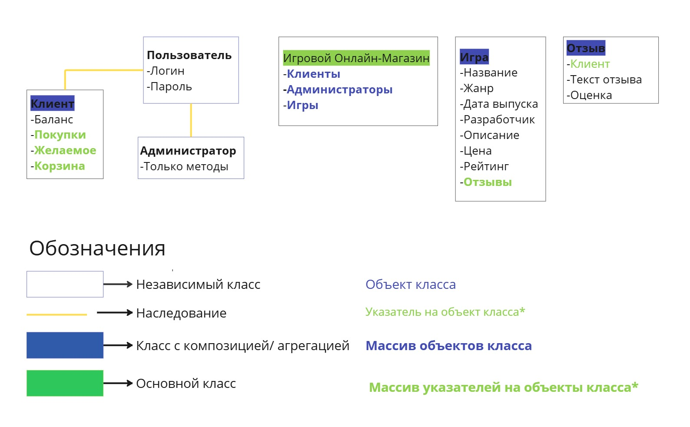

# Проект с индивидуальной предметной областью
**Выбранная предметная область:** ИГРОВОЙ ОНЛАЙН-МАГАЗИН.  

**Цель работы:** реализовать программное обеспечение для работы игрового онлайн-магазина, предоставляющего клиентам удобный доступ к каталогу игр, возможность их покупки, а администраторам инструменты для эффективного управления контентом, продажами и аналитикой.

## Задачи проекта:
1. Реализовать ПО для создания и мониторинга баз данных с информацией о пользователях и имеющихся играх.
2. Реализовать ПО для взаимодействия с пользователем.
4. Приложение должно обеспечивать возможность администратору быстро и легко выполнять свои функции:
- Просмотр и редактирование информации клиента.
- Регистрация нового клиента.
- Блокировка/Разблокировка клиента.
- Редактирование информации об игре.
- Добавление/Удаление игры.
- Редактирование/Удаление отзывов на игру.
- Просмотр статистики по продажам.
4. Приложение должно обеспечивать возможность клиенту легко и удобно пользоваться им:
- Просмотр информации об играх в каталоге, удобный поиск по категориям.
- Покупка игры сразу или добавление в корзину.
- Очистка корзины/Удаление игры из корзины.
- Добавление/Редактирование отзыва.
- Пополнение баланса.
- Просмотр личной информации(баланс,логин,пароль,покупки,желаемое)
- Добавление игры в желаемое.

## Функциональные требования:
Приложение реализуется в виде windows-приложения с удобным навигационным меню, качественным отображением информации и простыми формами для заполнения данных.

Основные возможности, которые будут предусмотрены приложением:
1. Приложение реализуется с авторизацией по логину/паролю.
2. Есть два режима работы: клиентский и администраторский. Администраторский существенно увеличивает права и возможности пользователя.
3. Приложение определяeт по логину, кем является пользователь - клиентом или администратором.
4. Все данные будут храниться в csv-формате и подтягиваться при очередном запуске приложения.

## Контейнер TVector
### Постановка задачи по реализации TVector
**Требования к классу.** TVector должен отвечать требованиям:
1. Обязан быть **шаблонным классом** и иметь возможность хранить всевозможные виды объектов;
2. Реализация должна соответствовать **принципам ООП**;
3. Функции класса должны реализовывать **эффективные алгоритмы**;
4. Хранение элементов обрабатывается **автоматически**, расширяясь по мере необходимости, класс **обязан гарантировать отсутствие утечек памяти**;
5. Класс должен быть проверен целиком на работоспособность (**покрыт «тестами»**), так как класс будет относиться к нашим базовым классам;
6. Код должен быть **«чистым»**;
7. **Стиль кодирования** должен успешно проходить проверку скриптом cpplint.py.

**Функциональные требования.** Класс TVector обязан реализовывать следующие функциональные возможности:  
1. Возможность создания  
a) пустого вектора по умолчанию,  
b) вектора заданного размера,  
c) вектора, созданного на основе переданного массива данных,  
d) конструктор копирования, а также уничтожения.
2. Функции: data(), size(), capacity(), front(), back() + функции begin(), end().
3. Функция проверки на пустоту is_empty().
4. Стандартные функции вставки: push_front(), push_back(), insert().
5. Стандартные функции удаления: pop_front(), pop_back(), erase().
6. Функция замены значения emplace().
7. Функция присваивания assign(), функция обращения по индексу at() с проверкой допустимости индекса, функция очистки вектора clear().
8. Функция shrink_to_fit() для возврата дополнительной памяти в систему. Функция резервирования памяти заданного размера reserve(); если меньше текущей памяти – ничего не происходит. Функция изменения размера массива resize() с заполнителем и без (работает как на расширение памяти, так и на сжатие).
9. Должны быть перегружены операторы: присваивания =, сравнения !=, ==, оператор [].

Обязательный **служебный функционал** представляет собой:
1. Функции работы с памятью в массиве;
2. Функция проверки на заполненность is_full().  

**Вне класса** реализовать (дружественные функции):  
1. Функцию перемешивания через алгоритм Фишера-Йейтса.
2. Эффективный способ сортировки массива.
3. Поиск элементов с заданными свойствами: первого, последнего, всех.

Также для данного контейнера проведено исследование уже существующего аналога из библиотеки vector в C++:  
[Исследование std::vector](source/STL_vector.pdf)
## Схема классов

