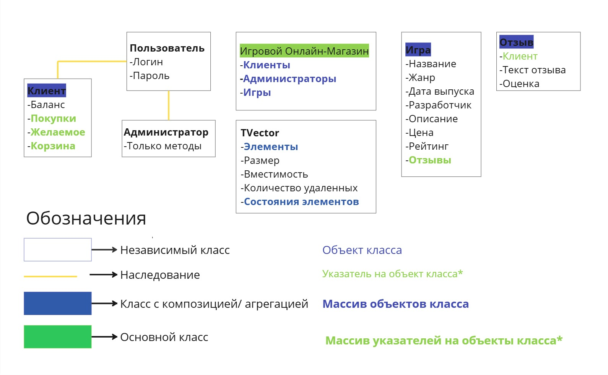

# Проект с индивидуальной предметной областью
**Выбранная предметная область:** ИГРОВОЙ ОНЛАЙН-МАГАЗИН.  

**Цель работы:** реализовать программное обеспечение для работы игрового онлайн-магазина, предоставляющего клиентам удобный доступ к каталогу игр, возможность их покупки, а администраторам инструменты для эффективного управления контентом, продажами и аналитикой.

## Задачи проекта:
1. Реализовать ПО для создания и мониторинга баз данных с информацией о пользователях и имеющихся играх.
2. Реализовать ПО для взаимодействия с пользователем.
4. Приложение должно обеспечивать возможность администратору быстро и легко выполнять свои функции:
- Просмотр и редактирование информации клиента.
- Регистрация нового клиента.
- Блокировка/Разблокировка клиента.
- Редактирование информации об игре.
- Добавление/Удаление игры.
- Редактирование/Удаление отзывов на игру.
- Просмотр статистики по продажам.
4. Приложение должно обеспечивать возможность клиенту легко и удобно пользоваться им:
- Просмотр информации об играх в каталоге, удобный поиск по категориям.
- Покупка игры сразу или добавление в корзину.
- Очистка корзины/Удаление игры из корзины.
- Добавление/Редактирование отзыва.
- Пополнение баланса.
- Просмотр личной информации(баланс,логин,пароль,покупки,желаемое)
- Добавление игры в желаемое.

## Функциональные требования:
Приложение реализуется в виде windows-приложения с удобным навигационным меню, качественным отображением информации и простыми формами для заполнения данных.

Основные возможности, которые будут предусмотрены приложением:
1. Приложение реализуется с авторизацией по логину/паролю.
2. Есть два режима работы: клиентский и администраторский. Администраторский существенно увеличивает права и возможности пользователя.
3. Приложение определяeт по логину, кем является пользователь - клиентом или администратором.
4. Все данные будут храниться в csv-формате и подтягиваться при очередном запуске приложения.

## Схема классов

